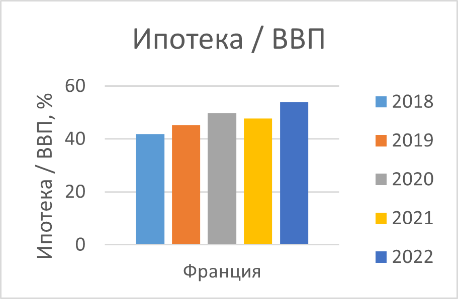

# Пузырь жилищного кредитования

## Постановка задачи:
Представьте себя Майклом Бьюрри и попытайтесь проанализировать динамику ипотечной нагрузки в разных странах. Для этого рассчитайте объем ипотечного портфеля на одного человека в разных странах, а также отношение объема ипотечного портфеля к номинальному ВВП за несколько периодов (например, за 3-5 лет). Отберите 5-7 любых стран, воспользовавшись источниками ниже или любыми другими ресурсами. 

Какая страна имеет самые высокие показатели? Есть ли риск ипотечного пузыря в этой стране? Почему? Поясните ваши результаты, дайте ответы на вопросы и представьте ваши выводы на 2-3 слайдах, сопровождая их визуализацией данных. 

## Источники:
Для симуляции режима “Майкл Бьюрри” предлагается использовать следующие данные:
* Мировые демографические перспективы: пересмотр на 2022 год. Отдел народонаселения ООН ([ссылка](https://data.worldbank.org/indicator/SP.POP.TOTL)),
* Кредитование на покупку дома домохозяйствам еврозоны ([ссылка](https://data.ecb.europa.eu/data/concepts/lending?searchTerm=&filterSequence=tags_array&sort=relevance&filterType=basic&showDatasetModal=false&filtersReset=false&resetAll=false&tags_array%5B%5D=House+purchase&tags_array%5B%5D=Lending&reference_area_name%5B%5D=Germany)),
* ВВП - Данные национальных счетов Всемирного банка и файлы данных национальных счетов ОЭСР ([ссылка](https://data.worldbank.org/indicator/NY.GDP.MKTP.CD)),
* Чтобы было с чем сравнить, взял данные по ипотеке США из вики ([ссылка](https://en.wikipedia.org/wiki/Subprime_mortgage_crisis)).

## Решение:
### Обработка данных:
* Скачал данные по северной (Австрия, Германия, Франция) и южной (Болгария, Кипр) Европе за 2018-2022 годы,
* Полученные данные с помощью Power Query привел к единому виду - годы/страны и валюта (EUR),
* Рассчитал объем ипотечного портфеля на одного человека в евро,

| Страна / Год |     2018 |     2019 |     2020 |     2021 |     2022 |
|--------------|---------:|---------:|---------:|---------:|---------:|
| Австрия      | 12399,48 | 13006,06 | 13603,61 | 14557,24 | 15451,96 |
| Болгария     |     1,95 |     2,34 |     2,61 |     2,79 |     3,21 |
| Кипр         |  8358,07 |  7019,65 |  6949,02 |  6816,43 |   6860,5 |
| Германия     | 14514,56 | 15243,47 | 16147,49 | 17278,53 | 18294,77 |
| Франция      | 15105,83 | 15972,55 | 16979,39 | 18158,72 | 19168,98 |

* Рассчитал отношение объема ипотечного портфеля к ВВП в процентах,

| Страна / Год |  2018 |  2019 |  2020 |  2021 |  2022 |
|--------------|------:|------:|------:|------:|------:|
| Австрия      | 27,71 | 29,87 | 32,06 | 31,28 | 34,12 |
| Болгария     | 0,024 | 0,027 |  0,03 | 0,026 | 0,026 |
| Кипр         |  45,9 | 38,23 |  39,2 | 33,08 | 33,76 |
| Германия     | 34,82 | 37,45 | 39,72 | 38,64 | 43,19 |
| Франция      |  41,8 | 45,36 | 49,84 | 47,82 | 53,92 |

* Представил данные в виде парных графиков по странам

#### Австрия
| |  |
|--------------|------:|
|||
#### Болгария
| |  |
|--------------|------:|
|||
#### Кипр
| |  |
|--------------|------:|
|||
#### Германия
| |  |
|--------------|------:|
|||
#### Франция
| |  |
|--------------|------:|
|||
#### США
| |  |
|--------------|------:|
|||

### Теория ипотечного пузыря:

[Ипотечный пузырь](https://www.banki.ru/news/daytheme/?id=10978387) – это ситуация на рынке ипотеки, при которой быстрые темпы роста ипотечного кредитования в определенный момент времени приводят к наращиванию просроченной задолженности в сегменте, росту доли высокорисковых заемщиков, обесценению ипотечных ценных бумаг и банковских залогов, падению цен на недвижимость и, как следствие, обвалу ипотечного рынка и всего рынка недвижимости.

[Признаки ипотечного пузыря:](https://blog.domclick.ru/ipoteka/post/chto-takoe-ipotechnyj-puzyr-i-chem-on-opasen-dlya-rynka-nedvizhimosti)
* Быстрый и необоснованный рост цен на жильё, который существенно опережает темпы роста доходов населения. При этом признаком схлопывания пузыря становится резкое снижение цен на недвижимость в результате роста предложения и падения спроса,
* Увеличение объёма ипотечных кредитов и рост доли заёмщиков, у которых нет достаточного уровня дохода для погашения ипотеки. Как результат — увеличение неплатежей по кредитам и рост числа проблемных должников,
* Рост выдач ипотеки с низким первоначальным взносом. Это также повышает доступность жилищных кредитов для тех заёмщиков, которые на самом деле не могут их себе позволить,
* Увеличение спекулятивных операций на рынке недвижимости, таких как покупка жилья с целью его последующей перепродажи с прибылью,
* Рост доли жилищного сектора в экономике страны, что может свидетельствовать о переоценке его роли.

## Выводы:
Как видно из описания ипотечного пузыря и его признаков, следует обратить внимание на такие показатели, как темпы роста цен, динамика просроченной задолженности, доля ипотек с низким первоначалным взносом и т.д.

В нашем распоряжении есть ипотечный портфель в отношении к населению и ВВП. Этого недостаточно для полноценной оценки, но позволяет получить первоначальное представление о рынке ипотечного кредитования в отдельных странах. 

Как можно видеть из графиков, ни в одной из изучаемых стран нет резкого роста расчетных показателей за 2018-2022 годы - это могло бы свидетельствовать о появлении пузыря. Также нет признаков схлопывания рынка в виде резкого снижения показателей, по аналогии с кризисом субстандартной ипотеки в США в 2008.

Во Франции целевые показатели имеют наибольшие значения. На основе имеющихся данных в стране отсутствуют признаки ипотечного пузыря - нет взрывного роста ипотечного портфеля как в расчете на человека, так и по отношению к ВВП.

Таким образом, на основе имеющихся данных можно сделать вывод, что ипотечный пузырь в изучаемых странах отсутствует. Но это неточно.
